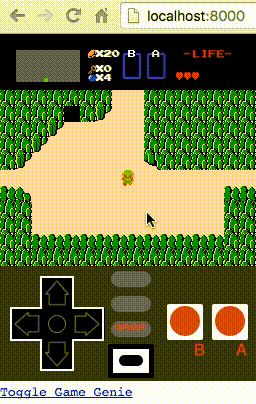

# The Legend of Cavas

The classic action RPG game from the Nintendo Entertainment System. Take Link through an array of dungeons and fight monsters to collect all the pieces of the Triforce and save Princess Zelda. Works on mobile devices. Supports Nintendo USB gamepad.

[Play](https://humbertodias.github.io/game-zelda-js/)

## Prerequiries

1. Python 3+
2. Any WebBrowser

## How to Run

Clone

```
https://github.com/humbertodias/game-zelda-js.git
```

On folder

```
cd game-zelda-js
```

Starting

```
python3 -m http.server
```

On Browser

```
http://localhost:8000
```

## Output




## Controls

Move Link

UP DOWN LEFT RIGHT

[ C ] B-Button Item

[ Space ] A-Button Item

[ Enter ] Menu

## References

[Slides](tinyurl.com/fluentzelda)  

[AirPair](https://www.airpair.com/javascript/posts/the-legend-of-canvas)

[Youtube Fluend 2016](https://www.youtube.com/watch?v=NJPAR7Meu3M)
